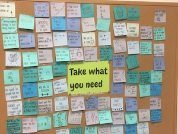

# Inspiration Board

## Introduction

In this project you will use a provided API to provide an inspiration board front-end.  You will build an application which displays a set of cards containing inspirational quotes and emoji images, like the board in the Ada common room.  Users should be able to add and remove cards.

Note there is a package installed called [`emoji-dictionary`](https://github.com/IonicaBizau/emoji-dictionary) which you can elect to use to display the emojis listed. The list of emoji most words can be found [`here`](https://github.com/Kikobeats/emojis-keywords/blob/master/index.js)

- Modify the `Board` component to use `axios` to retrieve card data from the end point:
  - `https://inspiration-board.herokuapp.com/boards/<YOUR-NAME>/cards`
  - Note that you should put your name in place of `<YOUR-NAME>`
- Create a shallow snapshot tests for the `Card` and `Board` component

- Try to deploy the app on Github pages [(nice tutorial, here!)](https://codeburst.io/deploy-react-to-github-pages-to-create-an-amazing-website-42d8b09cd4d)
